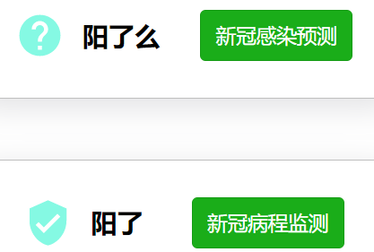
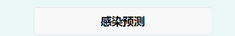

## 预测新冠

本项目在[covid-detect](https://git.weixin.qq.com/drowning-in-codes/covid-detect.git)与

[阳了吗](https://git.weixin.qq.com/wx_wxf2ff04695fb4db53/covid-control.git)仓库代码相同.

推送时新代码考虑两边都推送最新的代码.

## 项目结构

两个按钮 阳了吗和阳了

点击跳转到对应页面填写表格,表格信息类似.

进行感染预测和病程监测.

如果进行感染预测,可视化得到的结果 

病程监测类似.
